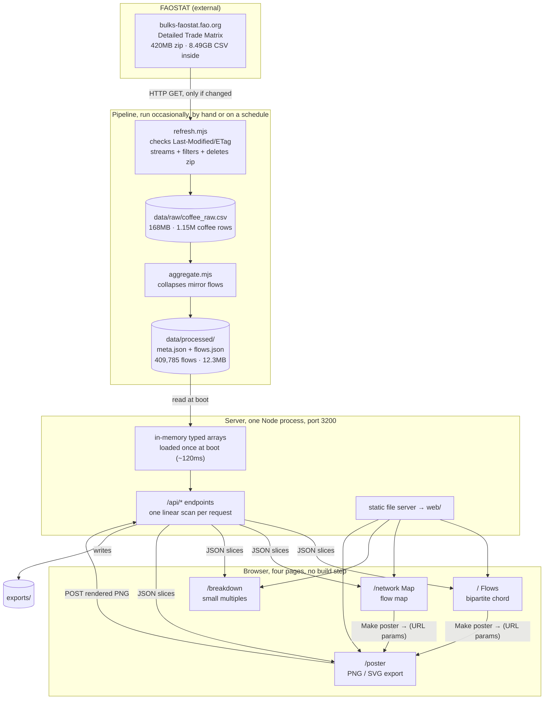
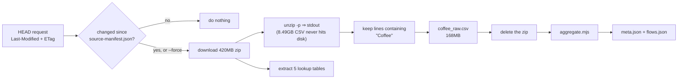
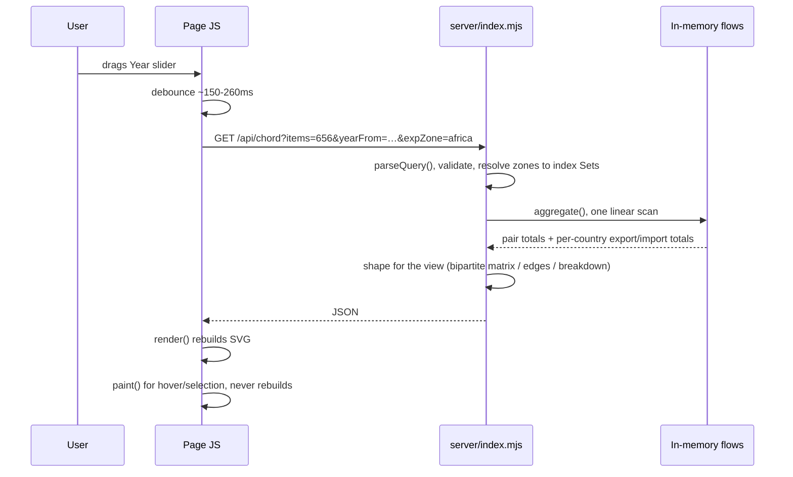
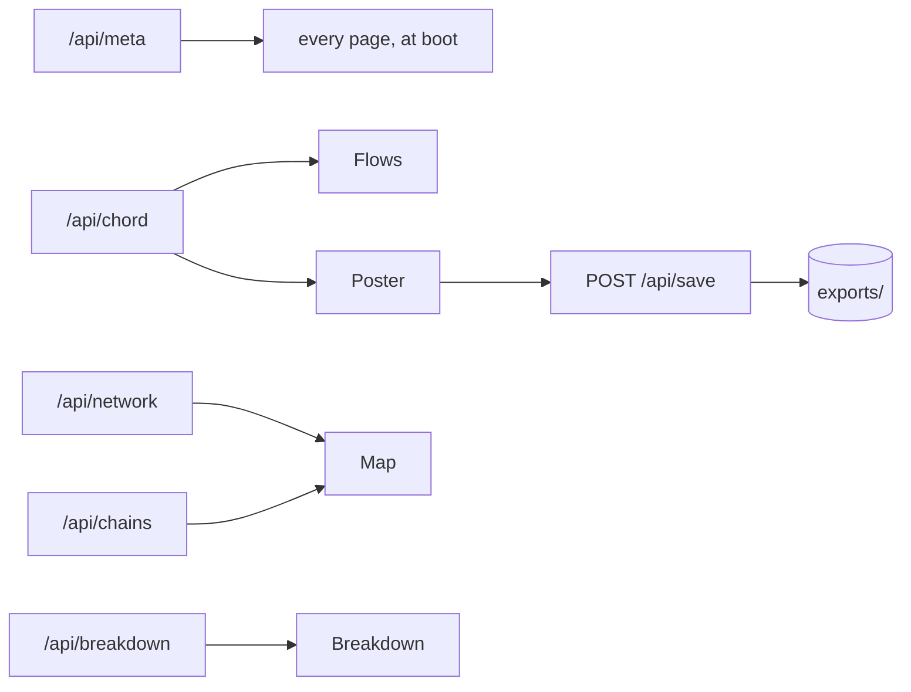

# System map

How the pieces connect: where the data comes from, what happens to it, and which UI
control drives which query parameter. Written for whoever picks this up next -
including me, months from now.

Diagrams are Mermaid; they render on GitHub and in most Markdown viewers.

---

## 1. The whole system at a glance



**The one thing to understand:** the server holds every flow in memory as typed
arrays, so any query is a single pass over ~410k rows, a few milliseconds. That is
why filters feel instant without shipping the dataset to the browser or pre-baking
every combination to disk. There is no database and no cache; there does not need to be.

---

## 2. Pipeline: 420MB in, 12MB out



Run it:

```bash
npm run refresh            # only if FAOSTAT published something new
npm run refresh -- --force # rebuild regardless
npm run aggregate          # re-derive JSON from the existing extract
```

### What aggregate.mjs actually does

Every trade appears **twice** in the source, once as the exporter's export, once as
the importer's import, with different numbers. Rows are collapsed onto a canonical
key and *both* sides are kept:

```
key = (exporter, importer, item, year)
value = { impQty, impVal, expQty, expVal }   ← nulls preserved as "not reported"
```

Reconciling to one figure happens at **serve** time, not here, so the UI can expose
the choice and the disagreement stays visible instead of being averaged away silently.

---

## 3. A request, end to end



`render()` vs `paint()` is a deliberate split on every page: hovering or selecting
only re-styles existing nodes. Rebuilding the DOM on mouse-move would make the
strand-heavy views crawl.

---

## 4. Which control drives what

Every page speaks the same query language. `parseQuery()` in `server/index.mjs` is the
single place these are read and validated.

| UI control | Parameter | Values | Pages |
|---|---|---|---|
| Coffee product | `items` | FAO codes: 656 green, 657 roasted, 658 substitutes, 659 extracts, 660 husks | all |
| Measure (Quantity/Value) | `metric` | `qty` \| `value` | Flows, Map, Poster |
| Year slider | `yearFrom` | 1986–2024 | all |
| Span slider | `yearTo` | derived: `yearFrom + span - 1` | all |
| Sellers from | `expZone` | zone id, filters the **exporter** side | all |
| Buyers in | `impZone` | zone id, filters the **importer** side | all |
| Reported by | `rule` | `importer` \| `exporter` \| `max` \| `mean` | all |
| Countries per side | `topExp`, `topImp` | 2–40 | Flows, Poster |
| Group the rest | `other` | `1` \| `0`, the "Other" buckets | Flows, Poster |
| Minimum flow | `minFlow` | tonnes/US$ floor | Map |
| Routes drawn | `topEdges` | edge cap | Map |
| Named origins | `topSources` | how many get their own colour | Breakdown |

Client-only controls, these never hit the server, they only change drawing:

| Control | Effect | Page |
|---|---|---|
| Scale (1 strand = X) | strand quantity; `auto` targets ~1,200–1,400 strands | Flows, Map, Poster |
| Growers only | hides routes whose seller has re-export ratio > 0.5 | Map |
| Simplify lines | one weighted line per route instead of a bundle | Map |
| Projection | Natural Earth / Equirectangular / Mercator / Globe | Map |
| Trace second leg | fetches `/api/chains`, draws dashed estimated legs | Map |
| Size dials by volume | dial radius vs uniform | Breakdown |
| Design (flows / map / breakdown) | which visualisation the poster renders | Poster |
| Format / Theme / Typeface / Resolution | poster geometry, ground and raster scale | Poster |
| Theme toggle | light / dark / follow-OS; the poster follows it on "auto" | all |
| Table view | accessible tabular fallback | Flows |

---

## 4b. Page × capability, the parity matrix

The flow diagrams above show how data moves. They cannot show what is *missing*, which
is a different failure mode: the Breakdown page shipped without a **Make poster** button
for a whole round of work, and no arrow on any diagram was wrong. This grid is the
check for that. When a page gains an affordance, add the row here and fill in the other
columns deliberately, "no, and here is why" is a valid answer, silence is not.

| Capability | Flows | Map | Breakdown | Poster |
|---|:--:|:--:|:--:|:--:|
| Product select | ✅ | ✅ | ✅ | ✅ |
| Measure (quantity / value) | ✅ | ✅ |, ¹ | ✅ |
| Sellers-from zone | ✅ | ✅ | ✅ | ✅ |
| Buyers-in zone | ✅ | ✅ | ✅ | ✅ |
| Year + span | ✅ | ✅ | ✅ | ✅ |
| Reported-by rule | ✅ | ✅ | ✅ | ✅ |
| Strand scale | ✅ | ✅ |, ² | ✅ |
| Group the rest into "Other" | ✅ |, ³ |, ⁴ | ✅ |
| Country search |, ⁵ | ✅ |, ⁵ | n/a |
| Tabular fallback | ✅ | ✅ | ✅ | n/a |
| Make poster → | ✅ | ✅ | ✅ | n/a |
| Theme toggle | ✅ | ✅ | ✅ | ✅ |
| Selection detail panel | ✅ | ✅ |, ⁶ | n/a |
| Reveal on scroll | n/a ⁷ | n/a ⁷ | ✅ | n/a ⁷ |

Deliberate absences:

1. Breakdown shows quantity **and** value at once, in its two trend panels, a measure
   toggle there would hide half the point.
2. Breakdown draws dials, not strands.
3. The map draws every route above the flow floor; there is no top-N to spill into an
   "Other" bucket.
4. Breakdown pools its tail automatically into one neutral "Other origins" wedge, sized
   by the *Named origins* slider.
5. **Open gap.** Search would earn its place on Breakdown (30+ dials); it is marginal on
   Flows, where 24 arcs are all labelled.
6. **Open gap.** Breakdown has hover tooltips but no pinned detail panel.
7. Single-viewport tools with nothing below the fold; the kit's rule is never to animate
   what the reader is already looking at.
8. The poster is an exporter, not a browser: it takes a fixed window from whichever page
   handed it over, so scrubbing there would have nothing to scrub.

---

## 5. Endpoints

| Endpoint | Returns | Used by |
|---|---|---|
| `GET /api/meta` | countries, items, years, zones, provenance, quality stats | all pages at boot |
| `GET /api/chord` | square matrix; `bipartite=1` splits each country into selling and buying sides | Flows, Poster |
| `GET /api/network` | node + edge list | Map |
| `GET /api/breakdown` | per-importer totals, sources, and yearly series | Breakdown |
| `GET /api/timeline` | world totals per year for the current filters | the time-range control |
| `GET /api/chains?origin=` | two-leg re-export chains, **estimated**, flagged `estimated: true` | Map |
| `POST /api/save?name=` | writes a rendered poster into `exports/` | Poster |



---

## 6. Files

```
pipeline/
  refresh.mjs        fetch + stream-filter + cleanup
  aggregate.mjs      mirror-flow reconciliation → JSON
  continents.mjs     FAO code → continent, historical successors
  zones.mjs          zone definitions + prose titles for posters
  check-mirror.mjs   diagnostic: how far apart the two reported sides are
server/
  index.mjs          load, parseQuery, aggregate, all endpoints
web/
  tokens.css         ambient-ui token layer, consumed as shipped
  shared.css         accent + data-token bridge, then the component layer
  motion.js          reveal-on-scroll (no CDN; the offline guarantee holds)
  filters.js         URL state + active-filter chips, shared by all three views
  timerange.js       dual-handle year range: volume profile, presets, Play
  funnel.js          the funnel ribbons + divided line, pure geometry
  dialcell.js        the whole dial cell: ONE spec + ONE painter  ← see §7
  theme.js           light / dark / follow-OS toggle, stored, drives the poster
  names.js           country display names        ← shared by all pages
  colour.js          value-driven tint + gradient helper  ← shared
  index.html  / chord.js       Flows
  network.html/ map.js         Map
  breakdown.html / breakdown.js  Breakdown
  dial-study.html    one dial drawn large, overlaid on the reference
  poster.html / poster.js      Poster
  vendor/            d3, topojson bundle, world-110m
data/raw/            coffee_raw.csv + lookup tables + source-manifest.json
data/processed/      meta.json, flows.json
exports/             rendered posters
```

---

## 7. Traps, things that already bit me once

- **A bare class cannot override a base element+attribute rule.** `.tr-h` is (0,1,0) and
  `input[type="range"]` is (0,1,1), so the base 148px width won no matter where the rules
  sat. Both range handles were laid out across 148px of a 397px track: the readout said
  2019-2023 while the thumbs sat over 1998, and it had been that way for a while because the
  selection band and the spark are positioned separately and were correct. Anything in here
  that restates a base range property carries `input[type="range"]` with it.
- **Seed the year control from state, never from "latest".** Hardcoding `years.at(-1)` made
  the Breakdown control claim 2024 while the page queried and drew 2019-2023. Flows and Map
  agreed with their controls only because their defaults happen to be the latest year.
- **Product names are not uniform.** "Coffee, green" inverts; "Coffee husks and skins" does
  not. Stripping a leading "Coffee, " and appending " coffee" is right for one of the five
  and gives "Coffee husks and skins coffee" for the rest. `window.prettyItem` in names.js is
  the one correct version; the poster and the pages both call it.
- **The URL is the state.** Every view-changing setting round-trips through `filters.js`, and
  only non-default values are written, so a default view has a clean address. A control that
  is populated after boot (both zone selects, which reset themselves to "all") has to be
  re-synced from state afterwards or a shared link filters the data correctly while the
  controls claim the opposite.
- **Contrast probes lie unless they composite.** Two of the three failures in the first audit
  pass were the probe's own bugs: it treated `rgba(...)` backgrounds as opaque and could not
  parse `color(srgb ...)` at all. Resolve colours through a 1x1 canvas and composite the
  ancestor stack, or you will spend an afternoon fixing text that was already fine.

- **The dial cell is specified and painted in exactly one place.** `dialcell.js` returns
  the spec and `paintDialCell` draws it; the grid, the poster and the study page supply a
  palette and nothing else. This is not tidiness, it is the fix for a real bug: when the
  page and the poster each drew the cell, the poster silently lost its year bars, then got
  them back at the wrong size. If you find yourself writing cell geometry anywhere else,
  that is the bug coming back.
- **The dial's proportions are measured, not chosen.** Against the disc radius R: line
  offset 0.335 R and line height 0.60 R, both taken off the reference. The intake trend
  beside it is 0.62 R wide and 0.20 R tall on a baseline 0.06 R above the centre, and stops
  0.18 R short of the divided line; the reference draws that series as bars, and this draws
  it as one stroked line, because five shapes at cell size compete with the disc for
  attention when the only question is whether this buyer is taking more than it used to.
- **On the map, a partner ring's denominator is the PARTNER's total, never the selection's.**
  Select Brazil and Germany's ring reads 42% because that is Brazil's share of Germany's
  intake, not Germany's share of Brazil's exports. Getting this backwards turns the feature
  into a second, worse drawing of the flow lines, which already carry tonnage. The point is
  the reading the lines cannot give: Brazil's biggest route by tonnage is Germany at 42%,
  its biggest by dependence is Argentina at 90%.
- **Radius is a size channel; it never touches the angle.** In the grid the radius carries
  the buyer's volume, so if it also moved the arc's opening no two dials would have
  comparable shapes. The angle is set by the line's offset from the centre, and because that
  offset is a fraction of R rather than an absolute distance, `acos(D/R)` is constant and the
  sweep is scale-invariant. The two are the same number twice: a sweep of S degrees puts the
  line at -cos(S/2) of the radius, so the measured 0.335 R is 219 degrees. `/dial-study`
  exposes it as an "arc opening" slider; the grid and the poster pass nothing and stay pinned
  at the reference value.
- **Type size is not a fraction of R.** Everything else in the cell is, which is why the
  study page's radius slider read as a zoom until the two were separated. The grid holds
  labels at 12px and varies only the disc; the poster derives label size from the cell, not
  the radius. Tie them together again and the radius stops meaning anything. The reference SVG is a bitmap trace, so its path data is noise,
  but its rim is a clean circle: a least-squares fit over the right-hand boundary gives
  centre (937.6, 509.2) and radius 498.6 in its own 1712x1024 frame. `/dial-study` registers
  the reference on our disc using exactly those numbers, so the two can be compared without
  anyone having to line them up by eye.
- **The line has to be short.** A line as tall as the disc gives every ribbon the same
  width at both ends and the funnel disappears. The widening from line to rim is the whole
  form.
- **The labels are painted last.** A long country name reaches to within a hair of the
  line, which is exactly where the largest ribbon leaves it. Paint the disc first or the
  name is the part that vanishes.

- **`d3.chordDirected`, never `d3.chord`.** Plain `chord()` sizes a group by its
  outgoing row only, which collapses every importer to zero width in a bipartite
  matrix, because importers only ever receive.
- **Port 3000 is not free.** Another project's Vite server commonly holds it, and a
  half-bound port (IPv4 here, IPv6 there) produces baffling cross-talk. This runs on
  **3200**.
- **The poster's SVG must be fully self-contained.** Rasterising goes through an
  ``, which loads the SVG in an isolated context with no access to the page's CSS
 , so every fill, font and gradient must be an attribute or a real `<defs>` node.
  Anything left to a stylesheet renders black.
- **Item names differ between the data and the lookup file.** The data says
  `"Coffee, green"` (comma, so the field is quoted); the codes file says
  `Coffee; green`. Matching on `,Coffee` silently returns nothing, match `"Coffee`.
- **Chart lightness encodes volume.** Hue says which side of the trade a country is
  on; lightness says how much it moved, with sellers and buyers scaled against their
  own largest. A country's colour therefore changes when the year or zone changes -
  that is the encoding working, not drifting. `countryTint()` is still there for
  cases with no magnitude to encode.
- **Chrome never borrows a data colour.** The accent is green precisely because the
  data owns blue, red and the warm ramp. A button in `--origin` blue silently claims
  "this country grows what it ships".
- **Six categorical hues do not pass the contrast floors.** That is why continent is
  carried by grouping and labels, and the primary encoding is the origin↔market
  diverging scale. Re-run the dataviz skill's `validate_palette.js` before changing
  any of it.
- **Historical states are real.** USSR, Czechoslovakia, Belgium-Luxembourg et al.
  appear and vanish across the year slider by design; dropping them would erase
  pre-1993 trade.
- **`/api/chains` is modelled, not measured.** Coffee is fungible. The second leg is
  proportional attribution capped at what the hub actually imported, never present
  it as observed.
- **A backgrounded `node server/index.mjs &` from a shell tool does not survive.**
  Start it as a tracked background process, or it dies between turns.
